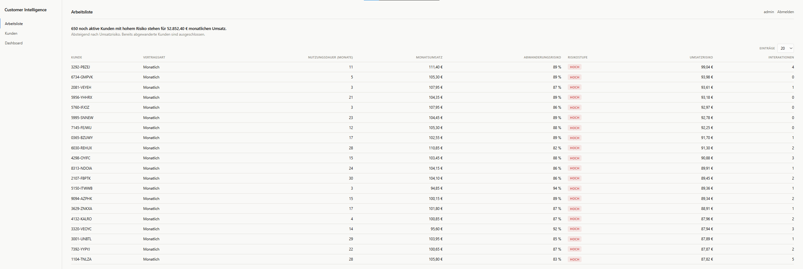
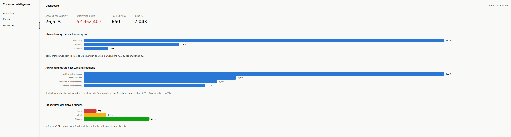
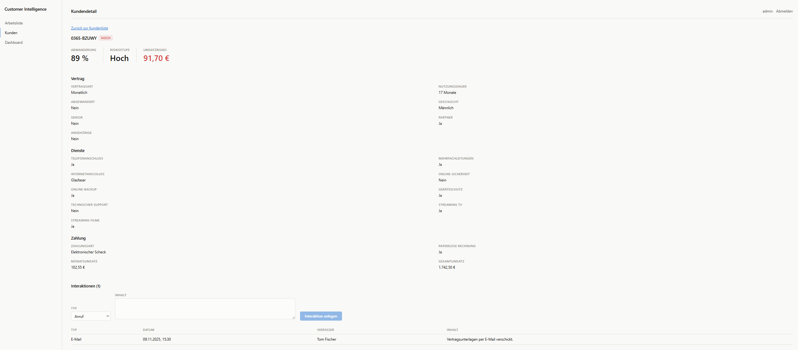
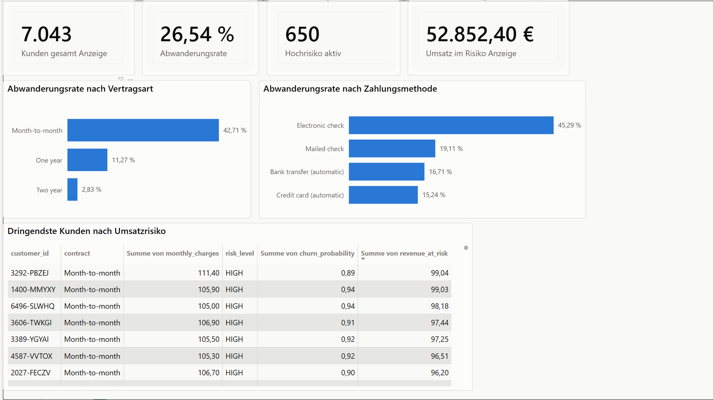
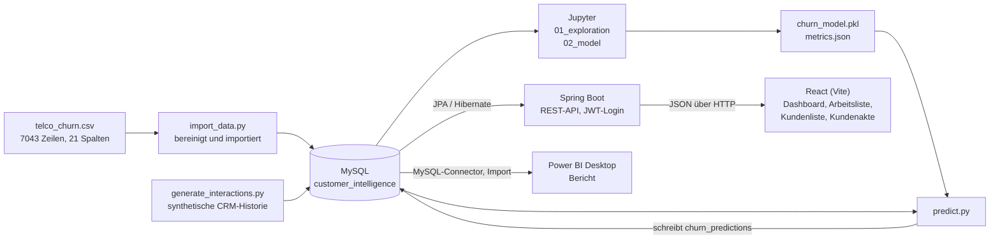

# Customer Intelligence Platform

**650 noch aktive Kunden mit hohem Abwanderungsrisiko stehen für 52.852,40 €
monatlichen Umsatz.**

Die Plattform liest den öffentlichen Telco-Churn-Datensatz in eine
MySQL-Datenbank, trainiert darauf ein Modell zur Abwanderungsvorhersage und
schreibt für jeden der 7043 Kunden eine Risikoeinschätzung zurück in die
Datenbank. Ein Spring-Boot-Backend macht daraus eine nach Umsatzrisiko
sortierte Arbeitsliste, eine durchsuchbare Kundenliste, eine Kundenakte mit
CRM-Historie und die Kennzahlen für ein Dashboard. Ein React-Frontend bedient
diese Endpunkte, ein Power-BI-Bericht liest dieselbe Datenbank für die
Auswertung.

---

## Screenshots

**Arbeitsliste** – die Startseite nach dem Login: Wen zuerst anrufen?
Absteigend nach Umsatzrisiko, abgewanderte Kunden ausgeschlossen.



**Dashboard** – Abwanderungsrate nach Vertragsart und Zahlungsmethode,
Risikostufen der aktiven Kunden. Die zusammenfassenden Sätze unter den
Diagrammen sind nicht fest eingetippt, sondern rechnen ihre Zahlen aus
denselben Daten wie das Diagramm darüber und können deshalb nicht veralten.



**Kundenakte** – Risikokennzahlen, Stammdaten in drei Gruppen, CRM-Historie
mit Formular für neue Interaktionen.



**Power-BI-Bericht** – zweiter Zugang für die Fachabteilung, liest dieselbe
MySQL-Datenbank und rechnet nicht getrennt nach.



---

## Architektur



Python, Java und Power BI kennen einander nicht, sie treffen sich nur in der
Datenbank – dadurch gibt es zu jeder Kennzahl genau eine Quelle. Nur das
Frontend spricht direkt mit dem Backend, über die REST-API und mit Token.

---

## Tech-Stack

- **Backend** – Java 21, Spring Boot 4.1, Spring Data JPA, Spring Security,
  JJWT, Maven
- **Datenbank** – MySQL 26.7
- **Analyse** – Python 3.14, pandas, scikit-learn, SQLAlchemy mit PyMySQL,
  Jupyter, matplotlib, seaborn, joblib
- **Frontend** – React 19, React Router, Vite 8, eigenes CSS ohne
  UI-Bibliothek
- **BI** – Power BI Desktop

---

## Daten

[Telco Customer Churn](https://www.kaggle.com/datasets/blastchar/telco-customer-churn)
von Kaggle (Nutzer *blastchar*, ursprünglich IBM Sample Data): 7043 Zeilen, 21
Spalten, je eine pro Kunde mit Vertrags-, Dienst- und Abrechnungsmerkmalen und
dem Abwanderungskennzeichen. 1869 sind abgewandert, 5174 nicht, das entspricht
26,54 %. Bekannter Stolperstein: `TotalCharges` ist als Text gespeichert und
bei elf Kunden leer, genau bei denen mit Nutzungsdauer 0 – der Import setzt
sie auf 0,00 € und bricht ab, falls ein leerer Wert bei anderer Nutzungsdauer
auftaucht.

**Die Interaktionsdaten sind synthetisch**, erzeugt von
`analytics/generate_interactions.py` mit festem Startwert je Kunden-ID, weil
es dafür keinen passenden öffentlichen Datensatz gibt. Sie füllen die
CRM-Oberfläche mit plausiblen Beispielen und fließen bewusst nicht ins Modell
ein: sonst würde es aus erfundenen Mustern lernen und seine Kennzahlen wären
wertlos.

---

## Modell

Logistische Regression mit `class_weight="balanced"`, als
scikit-learn-Pipeline aus `ColumnTransformer` (One-Hot-Encoding kategorial,
Standardisierung numerisch) und Klassifikator. Train-Test-Split 80/20,
stratifiziert. **Schwellenwert 0,4** statt 0,5, weil ein übersehener
Abwanderer mehr kostet als ein unnötiges Rabattangebot; bei 0,3 fällt die
Precision überproportional.

| Kennzahl  | Wert bei Schwellenwert 0,4 |
| --------- | -------------------------- |
| Precision | 0,468                      |
| Recall    | 0,858                      |
| F1        | 0,606                      |
| ROC-AUC   | 0,839                      |

**Warum nicht Accuracy als Hauptmaß:** 73,5 % der Kunden wandern nicht ab, ein
Modell, das ausnahmslos „bleibt“ sagt, erreicht damit 73,5 % Accuracy und
findet keinen einzigen Abwanderer. Recall und Precision beantworten dagegen,
worauf es ankommt – wie viele Abwanderer auf der Liste stehen und wie viel
Aufwand ins Leere geht.

Drei Varianten wurden verglichen, alle bei Schwellenwert 0,5. ROC-AUC hängt
nicht vom Schwellenwert ab und schied als Erstes den Random Forest aus
(0,817). Zwischen den beiden Regressionen war es mit je 0,839 gleichauf –
entschieden haben dort der F1-Wert (0,612 gegen 0,587) und vor allem der
deutlich höhere Recall (0,773 gegen 0,545):

| Modell                          | Precision | Recall | F1        | ROC-AUC   | Accuracy |
| ------------------------------- | --------- | ------ | --------- | --------- | -------- |
| Logistische Regression          | 0,636     | 0,545  | 0,587     | 0,839     | 0,796    |
| Logistische Regression balanced | 0,506     | **0,773** | **0,612** | 0,839 | 0,740    |
| Random Forest                   | 0,614     | 0,484  | 0,541     | 0,817     | 0,782    |

`predict.py` leitet daraus die Risikostufe (LOW unter 0,4, MEDIUM ab 0,4, HIGH
ab 0,7) und `revenueAtRisk = monthlyCharges × churnProbability` ab, nach dem
die Arbeitsliste sortiert. Der HIGH-Wert 0,7 ist nicht gegriffen, sondern das
75. Perzentil der Wahrscheinlichkeiten (empirisch 0,699) – so landet das
oberste Viertel in HIGH, eine handhabbare Anrufliste. Von den 5174 aktiven
Kunden sind das 650 mit hohem, 1159 mit mittlerem, 3365 mit niedrigem Risiko.

---

## Entscheidungen

**Logistische Regression statt eines komplexeren Modells.** Der Random Forest
lag beim ROC-AUC hinter beiden Regressionsvarianten (0,817 gegen jeweils
0,839), aber selbst bei Gleichstand hätte das lineare Modell gewonnen: Es
liefert vorzeichenbehaftete Koeffizienten, ein Baumverfahren nur unsignierte
Wichtigkeiten. Das zahlte sich sofort aus – `monthlyCharges` hat im Modell ein
negatives Vorzeichen (−0,42), obwohl der Betrag einzeln betrachtet positiv
korreliert (+0,19). Der Internetdienst konfundiert beides: Glasfaserkunden
zahlen mehr *und* kündigen mehr. Aus derselben Überlegung flog `totalCharges`
heraus, es korreliert mit 1,0 fast perfekt mit `tenure × monthlyCharges`.

**Unidirektionale JPA-Beziehungen.** `Interaction` und `ChurnPrediction`
kennen ihren Kunden, der Kunde kennt sie nicht – sonst müsste beides synchron
gehalten werden, die JSON-Ausgabe könnte in einen Zyklus laufen und es würde
mehr nachgeladen als nötig. Wo beide Seiten gebraucht werden, holt eine
JPQL-Abfrage sie gezielt: `JOIN FETCH` für die Arbeitsliste, `LEFT JOIN` für
die Kundenliste, damit Kunden ohne Vorhersage nicht herausfallen. Nachgemessen
mit `spring.jpa.show-sql`: 50 Kunden erzeugen genau zwei Anweisungen, kein N+1.

**Kein UI-Framework im Frontend.** `package.json` hat drei Abhängigkeiten:
React, React DOM, React Router. Kein Bootstrap, kein Material UI, kein
Tailwind, keine Diagrammbibliothek. Farben, Abstände und Typografie stehen
vorab in [`frontend/DESIGN.md`](frontend/DESIGN.md) und im Code als
CSS-Variablen. Das Balkendiagramm ist ein CSS-Grid, die Balkenlänge eine
Prozentbreite; SVG lohnte sich erst mit Achsen und Skalenstrichen.

**Upsert statt Neuladen beim Import.** `import_data.py` und `predict.py`
schreiben mit `INSERT ... ON DUPLICATE KEY UPDATE`, ein zweiter Lauf ergibt
dieselben 7043 Zeilen ohne Duplikate. `generate_interactions.py` überspringt
stattdessen Kunden, die schon eine Interaktion haben – eine über die
Oberfläche angelegte Notiz soll ein Skriptlauf nicht ersetzen. Genau das
deckte einen Fehler auf: Kunden mit zufällig null Interaktionen hinterließen
keine Zeile, galten beim nächsten Lauf als unbearbeitet, und die verschobene
Zufallsfolge ließ bei jedem Lauf neue Zeilen entstehen. Behoben mit einem
eigenen Zufallsgenerator je Kunde aus Startwert plus Kunden-ID.

**Aggregieren in der Datenbank, nicht in Java.** Die Dashboard-Kennzahlen
entstehen aus sechs Aggregatabfragen mit `COUNT`, `SUM` und `AVG`, keine lädt
Kundenzeilen. Deshalb hat auch die Zusammenfassungszeile der Arbeitsliste
einen eigenen Endpunkt – sie nennt Zahlen über alle Kunden, aus 20 geladenen
Zeilen wären die nicht zu berechnen. Sie nutzt dieselbe Abfrage wie das
Dashboard, damit zwei Seiten für dieselbe Zahl nicht auseinanderlaufen.

---

## Grenzen

- **Momentaufnahme ohne Zeitachse.** Jeder Kunde ist eine Zeile mit seinem
  Endzustand, ohne Historie und Kündigungsdatum. Das Modell sagt deshalb nicht
  vorher, *wann* jemand kündigt, sondern nur, ob er den bereits Abgewanderten
  ähnelt – und eine Validierung über die Zeit ist damit unmöglich.
- **Keine Verhaltensdaten.** Vertragsmerkmale, gebuchte Dienste und
  Abrechnung sind vorhanden, Nutzungsintensität, Supportanfragen, Störungen,
  Beschwerden und Zahlungsverzug nicht – genau die Signale, die kurz vor
  einer Kündigung entstehen.
- **Recall 0,858**, rund ein Siebtel der Abwanderer erscheint nicht auf der
  Liste. Die Precision von 0,468 heißt zugleich: Etwas mehr als die Hälfte
  der Angesprochenen hätte auch ohne Maßnahme gehalten. Beide lassen sich
  gegeneinander verschieben, nicht zugleich verbessern.
- **Vorhersagen so aktuell wie der letzte Skriptlauf.** `predict.py` ist ein
  Batch von Hand, das Backend liest nur die gespeicherte Tabelle.
- **Rechteverwaltung angelegt, aber nicht wirksam.** Die Rollen ADMIN und
  STAFF werden nirgends geprüft – wer ein gültiges Token hat, darf alles.
- **Token im `sessionStorage`**, damit für JavaScript lesbar. Sicherer wäre
  ein Cookie mit `HttpOnly`, `Secure` und `SameSite`, das aber wieder einen
  CSRF-Schutz nötig macht.
- **Dünne Testabdeckung.** Automatisiert geprüft wird, dass der Spring-Kontext
  startet; JPQL-Abfragen, Schwellenwertlogik und Sicherheitsregeln sind von
  Hand geprüft, nicht abgesichert.

---

## Setup

Java 21 oder neuer, MySQL 26.7 auf Port 3306, Python (entwickelt mit 3.14.7),
Node.js (entwickelt mit 24.14.1), für den Bericht Power BI Desktop. Maven
liegt als Wrapper bei.

**Repository, Datenbank, Konfiguration.** Die drei Dateien mit Zugangsdaten
sind nicht im Repository, in den Vorlagen steht überall `CHANGE_ME`. Den
Datensatz gibt es bei
[Kaggle](https://www.kaggle.com/datasets/blastchar/telco-customer-churn).

```bash
git clone https://github.com/giuseppe2406/customer-intelligence.git
cd customer-intelligence

mysql -u root -p -e "CREATE DATABASE customer_intelligence CHARACTER SET utf8mb4;"

cp src/main/resources/application.properties.example src/main/resources/application.properties
cp analytics/.env.example analytics/.env
cp frontend/.env.example frontend/.env

# WA_Fn-UseC_-Telco-Customer-Churn.csv ablegen als analytics/data/telco_churn.csv
```

**Import, Training, Vorhersagen.** Alle Skripte sind mehrfach ausführbar, ohne
Duplikate anzulegen. Das Notebook schreibt `models/churn_model.pkl` und
`models/metrics.json`, `predict.py` füllt daraus `churn_predictions`.

```bash
cd analytics
python -m venv .venv
source .venv/bin/activate        # Windows PowerShell: .\.venv\Scripts\Activate.ps1
pip install -r requirements.txt
python import_data.py
python generate_interactions.py
jupyter nbconvert --to notebook --execute --inplace notebooks/02_model.ipynb
python predict.py
```

**Backend und Frontend starten**, in zwei Terminals. Beim ersten Start legt
das Backend das Admin-Konto aus `application.properties` an; die Anmeldung im
Frontend erfolgt mit denselben Zugangsdaten.

```bash
cd ..
./mvnw spring-boot:run           # Windows: .\mvnw.cmd spring-boot:run   -> localhost:8080
```

```bash
cd frontend && npm install && npm run dev                                # -> localhost:5173
```

**Power-BI-Bericht.** `powerbi/dashboard.pbix` öffnen, über *Start > Daten
transformieren > Datenquelleneinstellungen* die MySQL-Zugangsdaten für
`localhost:3306` hinterlegen, *Aktualisieren* auswählen. Farbschema:
`powerbi/customer-intelligence-theme.json`.

---

## Nächste Schritte

- Tests für das bisher nur von Hand Geprüfte: JPQL-Abfragen,
  Filterkombinationen, Sicherheitsregeln.
- `predict.py` in einen Endpunkt oder geplanten Lauf überführen, damit die
  Risikostufen nicht veralten.
- Die Rollenprüfung anwenden. Der 403-Pfad ist eingerichtet, es fehlt die
  Absicherung der schreibenden Endpunkte.
- Kalibrierung prüfen: Wandern von den Kunden mit Wert 0,8 tatsächlich rund
  80 % ab? Solange das offen ist, ist `revenueAtRisk` Rangfolge, kein Betrag.
- Monatliche Momentaufnahmen der Vorhersagen speichern. Damit entstünde
  wenigstens im eigenen System die Zeitachse, die dem Datensatz fehlt.

---

MIT-Lizenz, siehe [LICENSE](LICENSE).
